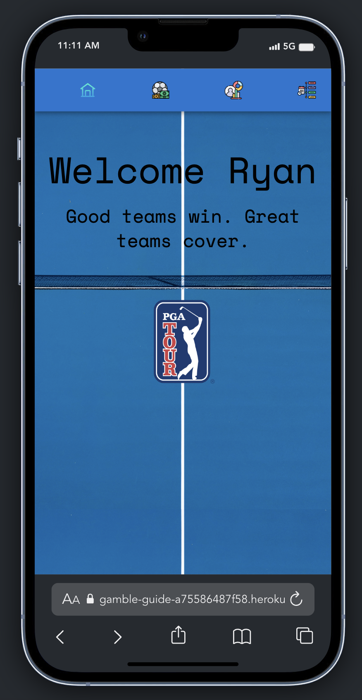
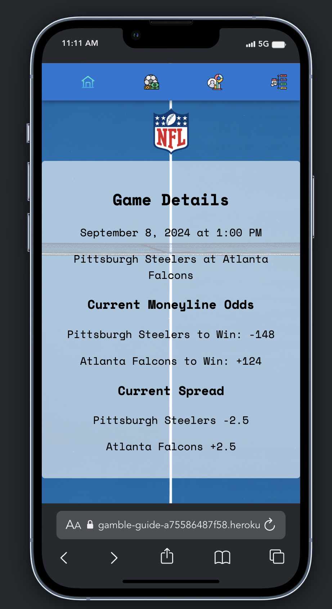
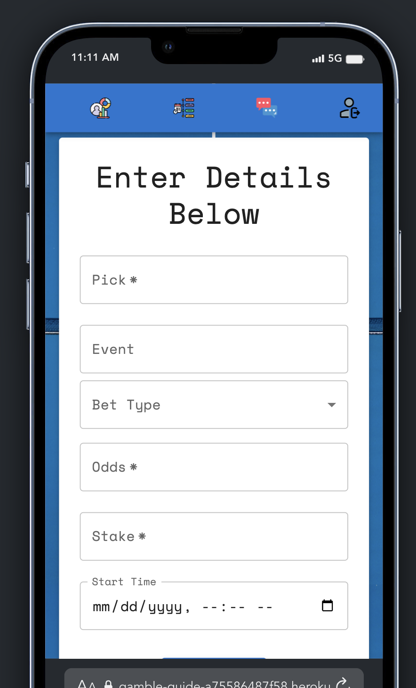

# Gamble Guide

Keep track of all your sports wagers in one app as well as getting real-time live odds for upcoming sporting events from the top bookmakers.

[App](https://gamble-guide-a75586487f58.herokuapp.com/)
[Backend Repo](https://github.com/rcallebs/Wager-Vision-Server)

# By: Ryan Callebs

## Description

After signing up, users can enter their bets with detailed information including the odds, stake, and events that were included in the bet.

All app users can view upcoming sporting events and live odds for each event.

Registered users can view all past bets and see a details page for their betting history that shows overall wins/losses along with their profit/loss margin.

    
    
    

## Future Features

Have the ability to add multiple legs to a bet to create parlays.
Be able to click on an upcoming game's team and have those details (start time, odds, event, pick) prefilled where the user only needs to enter their wager amount.
Add more detailed charts on the user statistics page breaking down bets by sport and when they were placed.

## Technologies Used

- MongoDB
- Mongoose
- React
- CSS
- Express.js
- Node.js
- Trello
- Mermaid
- Material UI
- The-Odds-API
- Chart.js
- Date-fns

# References

- [Material UI](https://mui.com/material-ui/getting-started/)
- [Trello Board](https://trello.com/b/oP3i0H8S/bet-tracker-app)
- [The-odds-api guide](https://the-odds-api.com/liveapi/guides/v4/#overview)
- [The-odds-api github](https://github.com/the-odds-api)
- <a href="https://www.flaticon.com/free-icons/bet" title="Bet icons">Navigation Icons found on - Flaticon</a>
- [Animations](https://www.w3schools.com/css/css3_animations.asp)
- [Animations more](https://stackoverflow.com/questions/54758648/how-to-create-a-simple-spinning-animation-for-an-image-in-react)
- [Chart.js](https://www.chartjs.org/docs/latest/)
- [Background Image](https://unsplash.com/photos/blue-and-white-striped-textile-yUDldIrqW5E)
- [Date-fns](https://date-fns.org/docs/Getting-Started)
- Google Fonts
- John Jacobs
- Jan Horak
- Quentin Donnelly
